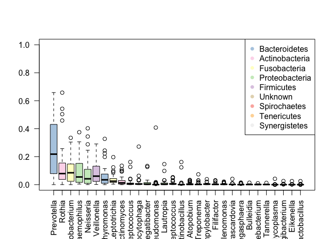
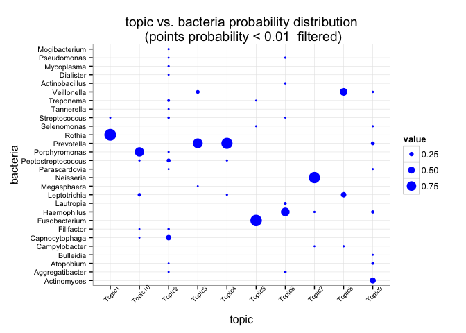
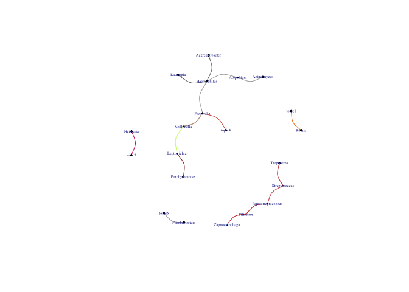
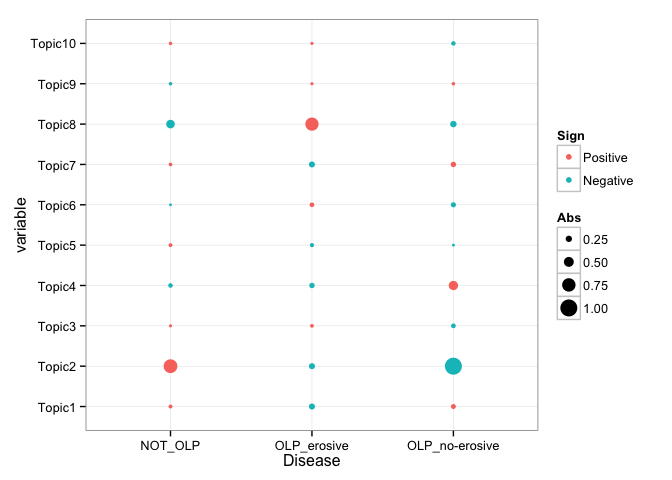
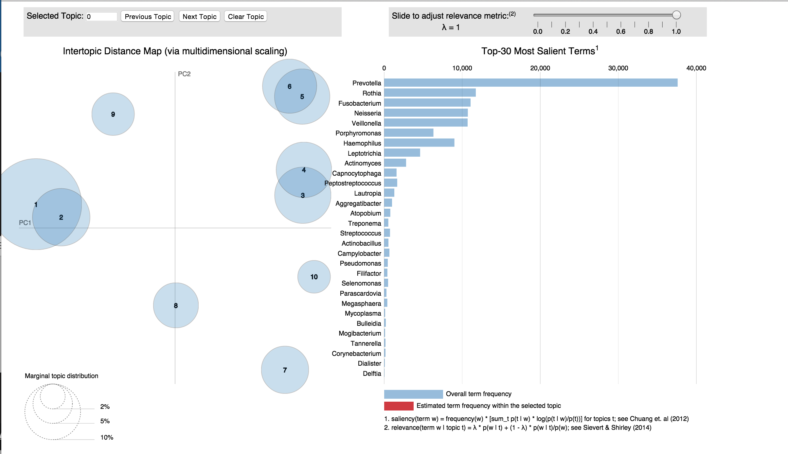

# Metatopics

- **MetaTopics** is the first R package to apply topic model for metagenomic data analysis by estimation of the microbial community and their connections.

- **MetaTopics** is developed to infer the microbial community structure across multiple samples based on a powerful statistical learning model, i.e., the topic model, originally derived in text mining community. Topic model is a computational framework which was originally designed to uncover the hidden thematic structure in document collections. The basic idea of this model is that it assumes that each topic consists of the highly correlated words and each document may contain several different topics with a certain probability distribution, and the distribution of such potential topics can be inferred by given the set of documents together with their word frequency representations. In particularly, a Bayesian based method called Latent Dirichlet Allocation (LDA) can be used in such inference. As for metagenomic analysis, each inferred topic could be viewed as a latent sub-community of the considered microbiome.

- As an example, we presented our in-house oral microbial data from 39 human samples (collected by the Stomatological Hospital Affiliated to Tongji University, Shanghai,China). These sample data are 16s-rRNA-sequencing-based, which are targeted on a clinically classical oral diease, i.e. the oral lichen planus (OLP), a chronic oral disease without clear pathological mechanism and effective treatment. These samples can be grouped as the controls (**NOT_OLP**) and two OLP disease sub-types - **OLP_non-erosive** and **OLP_erosive**. Using **MetaTopics**, the relationship between topics and a specific disease is deciphered, which provides new clues to understand the pathological mechanism of OLP. The following examples present an comprehensive illustration of using **MetaTopics** in the analysis of these samples.
- Install: you can install the **MetaTopics** package from Github using **devtools** packages.


```r
require(devtools)
install_github("bm2-lab/MetaTopics")
library(MetaTopics)
```

- The data **meta_counts** is a matrix containing the read counts of the microbe in each individual sample mapped to a certain microbial reference. The data **genus_2_phylum** is a data frame containing the annotation for the microbe in data meta_counts


```r
dim(meta_counts)
```

```
## [1]  39 129
```

```r
colnames(meta_counts)[1:10]
```

```
##  [1] "Abiotrophia"     "Acholeplasma"    "Achromobacter"  
##  [4] "Acidaminococcus" "Acidovorax"      "Acinetobacter"  
##  [7] "Actinobacillus"  "Actinomyces"     "Aggregatibacter"
## [10] "Alloscardovia"
```

```r
head(genus_2_phylum)
```

```
##                           genus         phylum presence  colour
## Abiotrophia         Abiotrophia     Firmicutes        1 #DECBE4
## Acholeplasma       Acholeplasma        Unknown        0 #E5D8BD
## Achromobacter     Achromobacter Proteobacteria        1 #CCEBC5
## Acidaminococcus Acidaminococcus        Unknown        0 #E5D8BD
## Acidovorax           Acidovorax        Unknown        0 #E5D8BD
## Acinetobacter     Acinetobacter Proteobacteria        1 #CCEBC5
```

The column phylum has the corresponding phylum level annotation for each microbiome. The column colour is used for abundance.plot as an identification of the phylum level. In our example, the data has 39 samples and the data **lls** contains the disease type annotation information for each sample.


```r
rownames(meta_counts)
```

```
##  [1] "NO2"  "NO6"  "NO8"  "NO9"  "NO13" "NO14" "NO15" "NO16" "NO18" "NO19"
## [11] "NO22" "NO23" "NO24" "NO25" "NO28" "NO30" "NO31" "NO32" "NO34" "NO35"
## [21] "NO36" "NO37" "NO38" "NO39" "NO40" "NO41" "NO42" "NO43" "NO44" "NO45"
## [31] "NO46" "NO48" "NO49" "NO50" "NO52" "NO53" "NO54" "NO55" "NO56"
```

```r
table(lls)
```

```
## lls
##        NOT_OLP    OLP_erosive OLP_no-erosive 
##             16             14              9
```

Users can explore the abundance distribution profile of the data:


```r
meta_abundance <- micro.abundance(meta_counts,1)
genus_2_phylum=genus_2_phylum[colnames(meta_abundance),]
abundance.plot(meta_abundance,classification = genus_2_phylum$phylum,col=genus_2_phylum$colour)
```

<!-- -->

- In order to use topic model, some odd samples and microbe need to be filtered. Users can use the function **noise.removal** in package **BiotypeR** to perform this procedure.


```r
library(BiotypeR)
data.denoized=noise.removal(t(meta_counts), percent=0.01)
samples=colnames(data.denoized)
bacteria=rownames(data.denoized)
data.final=meta_counts[samples,bacteria]
dim(data.final)
```

```
## [1] 39 88
```

After the pre-processing, the final data contains 39 samples with 88 microbe taxons.

- With the processed data in-hand, users can use cross-validation to find the appropriate topic number for topic model. The function **selectK** could be used to select the appropriate topic number and the function **plot_perplexity** helps to visualize the returned perplexity and likelihood in the topic number selection.


```r
library(slam)
library(topicmodels)
dtm=as.simple_triplet_matrix(data.final)
seed_num=2014
fold_num=5
kv_num = c(2:30)
sp=smp(cross=fold_num,n=nrow(dtm),seed=seed_num)
control = list(seed = seed_num, burnin = 1000,thin = 100, iter = 1000)
#not run: system.time((ctmK=selectK(dtm=dtm,kv=kv_num,SEED=seed_num,cross=fold_num,sp=sp,method='Gibbs',control=control)))
#not run: plot_perplexity(ctmK,kv_num)
```

- If users specify the topic number, function **LDA** in package **topicmodels** can be used to build the model. Here is an example with the topic number 10 specified.


```r
Gibbs_model_example = LDA(dtm, k = 10, method = "Gibbs",
            control = list(seed = seed_num, burnin = 1000,thin = 100, iter = 1000))
```

- The returned model is a S4 Object. The element **beta** in the model contains the estimation of the probability of each microbe in each topic.


```r
dim(Gibbs_model_example@beta)
```

```
## [1] 10 88
```

```r
apply(exp(Gibbs_model_example@beta),1,sum)
```

```
##  [1] 1 1 1 1 1 1 1 1 1 1
```

The function **plot_beta** is a visualization way to view the matrix result. This plot is based on ggplot2. The parameter **prob** is a cutoff used to restrict the number of points on the plots. If a microbe has a probability smaller than the cutoff in a topic, it will not be shown in the visualizd result.


```r
library(ggplot2)
plot_beta(Gibbs_model_example,prob=0.01)
```

<!-- -->

The element **gamma** in the model containes the estimation of the probability of each topic in each sample. This function will act as a visualization representation of the result matrix. The parameter聽prob聽is a cutoff used to restrict the number of points on the plots. If a topic has a probability smaller than the cutoff in an individual, it will not be shown in the visualizd result.


```r
plot_gamma(Gibbs_model_example,lls,prob=0.05)
```

<!-- -->

In order to interpret the relationships between the sub-communities and disease, Quetelet Index is introduced to estimate the relative change of the observation/occurence frequency of a latent sub-community among all the samples compared to that among the samples with a certain disease statue. Function **qindex** is used to compute the Quelete Index from the topic model. Quelete Index quantitatively describes the degree of the influence of the specific topic on certain disease. Parameter **prob** is a probability cutoff used to identify a meaningful sub-community observation. For a certain individual, the topics with probability no smaller than prob will be thought as a meaningful observation in this individual.


```r
Q_values <- qindex(Gibbs_model_example,lls,0.05)
head(Q_values)
```

```
##     label variable      quelete
## 1 NOT_OLP   Topic1  0.083333333
## 2 NOT_OLP   Topic2  0.772727273
## 3 NOT_OLP   Topic3  0.027667984
## 4 NOT_OLP   Topic4 -0.129186603
## 5 NOT_OLP   Topic5  0.083333333
## 6 NOT_OLP   Topic6 -0.004784689
```

```r
Q_values$Sign = factor(ifelse(Q_values$quelete<0,'Negative','Positive'),levels=c('Positive','Negative'))
Q_values$Abs = abs(Q_values$quelete)
p<-ggplot(Q_values,aes(label,variable))
p+geom_point(aes(cex=Abs,colour=Sign))+
  theme_bw(base_size = 12,base_family = "")+
  labs(x='Disease')
```

<!-- -->

- Package LDAvis, build by ***Carson Sievert*** is a great tool to visualize and interpre the topics. It provides an web-based interaction application to show the relationship among topics and rank the terms, i.e. bacteria here, in each topic based on your topic model.


```r
library(LDAvis)
json <- with(TwentyNewsgroups,
             createJSON(phi, theta, doc.length, vocab, term.frequency))

json <- createJSON(phi = exp(Gibbs_model_example@beta),
                   theta = Gibbs_model_example@gamma,
                   doc.length = apply(data.final,1,sum),
                   vocab = Gibbs_model_example@terms,
                   term.frequency = apply(data.final,2,sum))
#not run
#serVis(json)
serVis(json, out.dir='olp_html',open.browser = FALSE)
```

```
## Warning in dir.create(out.dir): 'olp_html'已存在
```



